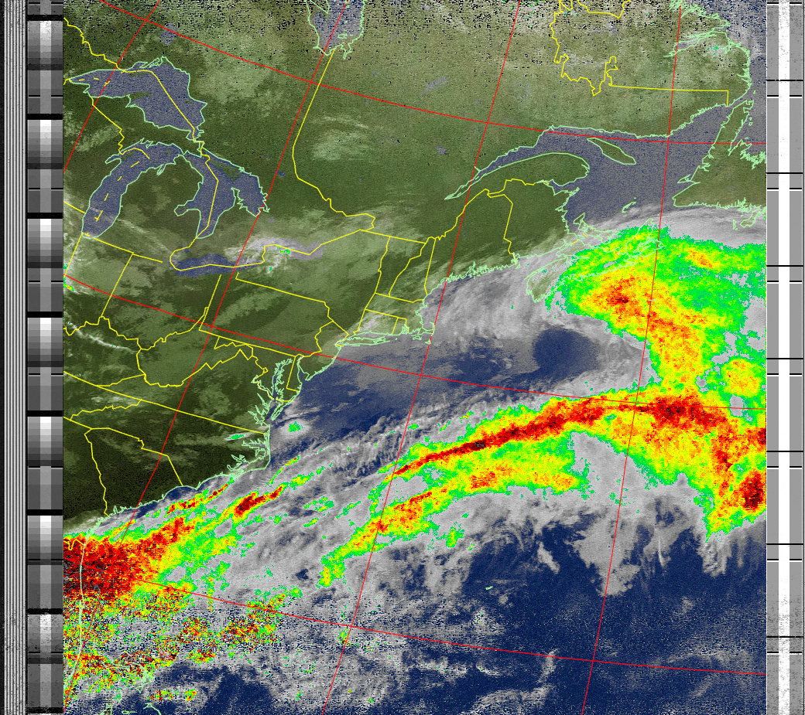

# Automated NOAA Weather Satellite Ground Station



## Introduction

This project allows you to create a fully automated ground station that will receive and decode NOAA weather satellite images and upload them to your own website served from an Amazon AWS S3 bucket. [See my example S3 site](https://wximages.s3-us-west-1.amazonaws.com/index.html).

This projected was originally adapted from an [Instructables article](https://www.instructables.com/id/Raspberry-Pi-NOAA-Weather-Satellite-Receiver/) by Jim Haslett that outlines how to customize a Raspberry Pi to receive weather images. The goal was to play the RPI close to the antenna to reduce feed-line loss.

The project was then adapted in this [article](https://nootropicdesign.com/projectlab/2019/11/08/weather-satellite-ground-station/) where the images were automatically uploaded to S3 then displayed on a website.

The goal of this branch is to extend the functionality that has been established and allow the weather station information to scale for weather stations that are constantly collecting information for server days, weeks, or months at a time.

---

## Installation Instructions

Here’s what you’ll need:

* Raspberry Pi (version 3 or 4) - you'll need Wi-Fi if you are using it outdoors or away from a network connection
* Raspberry Pi case
* MicroUSB power supply
* 32GB SD card
* SDR device - I recommend the RTL-SDR V3 dongle from RTL-SDR.COM blog
* AWS account for hosting images and web content in an Amazon S3 bucket. You can sign up for the free tier for a year, and it’s still cheap after that
* An antennea such as a dipole or a QFH
* coaxial cable to go from your antenna to Raspberry Pi + RTL-SDR dongle. The dipole antenna kit comes with 3m of RG174 coax, but I used 10 feet of RG58 coax.

>Dipole Antenna - You can build a simple dipole antenna with elements 21 inches (53.4 cm) long adjusted to a 120 degree angle between the elements. Here’s a great [article](http://lna4all.blogspot.com/2017/02/diy-137-mhz-wx-sat-v-dipole-antenna.html) on design or you can just buy [this dipole kit](https://www.rtl-sdr.com/product/rtl-sdr-blog-multipurpose-dipole-antenna-kit/) from the RTL-SDR.COM blog.

### Amazon AWS Setup

The website for the ground station will be a serverless application hosted on S3. The RPI will use some Node.js scripts to upload all of the images and related assets. Here are the steps to setup your AWS account:

#### AWS Credentials

The scripts that run on the RPI are powered by Node.js and the AWS JavaScript SDK. To get them to all work, you will need to get credentials for your account. These two articles show you how to access or generate your credentials and store them for Node.js access:

[Getting your credentials](https://docs.aws.amazon.com/en_pv/sdk-for-javascript/v2/developer-guide/getting-your-credentials.html)
[Loading Credentials in Node.js from the Shared Credentials File](https://docs.aws.amazon.com/en_pv/sdk-for-javascript/v2/developer-guide/loading-node-credentials-shared.html)

Your credentials file on the Raspberry Pi `~/.aws/credentials` will look like this:

```
[default]
aws_access_key_id = YOUR_ACCESS_KEY_ID
aws_secret_access_key = YOUR_SECRET_ACCESS_KEY
```

Set the default region where your S3 bucket will reside in `~/.aws/config`. For example:

```
[default]
output = json
region = us-west-1
```

#### Create an S3 Bucket

Now create an S3 bucket for public website hosting such as `wximages`. The following articles shows how to setup a bucket for public website hosting:
[Setting up a Static Website](https://docs.aws.amazon.com/en_pv/AmazonS3/latest/dev/HostingWebsiteOnS3Setup.html)

At this point you should be able to load a simple web site from your new bucket. You might want to upload a simple `index.html` file and try to load it in your browser with `http://BUCKETNAME.s3-website-REGION.amazonaws.com/`.

```
<!doctype html>
<html>
 <head><title>S3 test</title></head>
 <body>Hello from S3</body>
</html>
```

#### Create an Identity Pool in Cognito

To give public users the ability to access your S3 bucket using the AWS SDK, you need to set up an identity pool and create a policy allowing them read access to your bucket. This is done using Amazon Cognito. A good guide for granting public access to your bucket is described in [this article](https://docs.aws.amazon.com/en_pv/sdk-for-javascript/v2/developer-guide/s3-example-photos-view.html) that shows how to serve images from an S3 bucket just like in this project.

**Step 1:** [create an Amazon Cognito identity pool](https://docs.aws.amazon.com/en_pv/sdk-for-javascript/v2/developer-guide/getting-started-browser#getting-started-browser-create-identity-pool) called `wx image users` and enable access to unauthenticated identities. Be sure to select the region in the upper right of the page that matches the region where your S3 bucket was created! Make note of the role name for unauthorized users, e.g. `Cognito_wximageusersUnauth_Role`.

**Step 2:** on the Sample Code page, select JavaScript from the Platform list. Save this code somewhere, because we need to add it to the web content later. It looks something like this:

```
// Initialize the Amazon Cognito credentials provider
AWS.config.region = 'us-west-1'; // Region
AWS.config.credentials = new AWS.CognitoIdentityCredentials({
 IdentityPoolId: 'us-west-1:1d02ae39-3a06-497e-b63c-799a070dd09d',
});
```

**Step 3:** Add a Policy to the Created IAM Role. In [IAM console](https://console.aws.amazon.com/iam/), choose `Policies`. Click `Create Policy`, then click the JSON tab and add this, substituting BUCKET_NAME with your bucket name.

```
{
 "Version": "2012-10-17",
 "Statement": [
 {
  "Effect": "Allow",
  "Action": [
  "s3:ListBucket"
  ],
  "Resource": [
  "arn:aws:s3:::BUCKET_NAME"
  ]
 }
 ]
}
```

Click `Review policy` and give your policy a name, like `wxImagePolicy`.

In IAM console, click `Roles`, then choose the unauthenticated user role previously created when the identity pool was created (e.g. `Cognito_wximageusersUnauth_Role`). Click `Attach Policies`. From the `Filter policies` menu, select `Customer managed`. This will show the policy you created above. Select it and click Attach policy.

**Step 4.** Set CORS configuration on the S3 bucket. In the S3 console for your bucket, select `Permissions`, then `CORS configuration`.

```
<?xml version="1.0" encoding="UTF-8"?>
<CORSConfiguration xmlns="http://s3.amazonaws.com/doc/2006-03-01/">
 <CORSRule>
 <AllowedOrigin>*</AllowedOrigin>
 <AllowedMethod>GET</AllowedMethod>
 <AllowedMethod>HEAD</AllowedMethod>
 <AllowedHeader>*</AllowedHeader>
 </CORSRule>
</CORSConfiguration>
```
### Raspberry Pi Setup

Install Required Packages
First, make sure your Raspberry Pi is up to date:

```
sudo apt-get update
sudo apt-get upgrade
sudo reboot
```

Then install a set of of required packages.

```
sudo apt-get install libusb-1.0
sudo apt-get install cmake
sudo apt-get install sox
sudo apt-get install at
sudo apt-get install predict
```

I used Node.js in some of the scripting, so if you don’t have `node` and `npm` installed, you’ll need to do that. In depth [details are here](https://github.com/nodesource/distributions/#deb), and I easily installed with:

```
curl -sL https://deb.nodesource.com/setup_10.x | sudo -E bash -
sudo apt-get install -y nodejs
```

Using your favorite editor as root (e.g. `nano`), create a file `/etc/modprobe.d/no-rtl.conf` and add these contents:

```
blacklist dvb_usb_rtl28xxu
blacklist rtl2832
blacklist rtl2830
```

#### Build rtl-sdr

Even if you have `rtl-sdr` already built and installed, it’s important to use the version in the GitHub repo [keenerd/rtl-sdr](https://github.com/keenerd/rtl-sdr), as this version’s `rtl_fm` command can create the WAV file header needed to decode the data with `sox`.

```
cd ~
git clone https://github.com/keenerd/rtl-sdr.git
cd rtl-sdr/
mkdir build
cd build
cmake ../ -DINSTALL_UDEV_RULES=ON
make
sudo make install
sudo ldconfig
cd ~
sudo cp ./rtl-sdr/rtl-sdr.rules /etc/udev/rules.d/
sudo reboot
```

#### Install and Configure wxtoimg

The program `wxtoimg` is what does the heavy lifting in this project. It decodes the audio files received by the RTL-SDR receiver and converts the data to images. The original author of wxtoimg has abandoned the project, but it is mirrored at [wxtoimgrestored.xyz](https://wxtoimgrestored.xyz/).

```
wget https://wxtoimgrestored.xyz/beta/wxtoimg-armhf-2.11.2-beta.deb
sudo dpkg -i wxtoimg-armhf-2.11.2-beta.deb
```

Now run `wxtoimg` once to accept the license agreement.

```
wxtoimg
```

Create a file `~/.wxtoimgrc` with the location of your base station. As usual, negative latitude is southern hemisphere, and negative longitude is western hemisphere. Here is what it would look like for the White House as an example.

```
Latitude: 38.8977
Longitude: -77.0365
Altitude: 15
```

The program `predict` is used by the automated scripts to predict weather satellite orbits. Run `predict` to bring up the main menu. Select option ‘G’ from the menu to set your ground station location.

You can enter whatever you want for the callsign such as your amateur radio callsign. **When entering the longitude, note that positive numbers are for the western hemisphere and negative numbers are for the eastern hemisphere.** This is opposite convention, so make sure you get this right or you’ll be listening when there’s no satellite overhead!

#### Get the Automation Scripts and Configure

The following scripts will automate the thumbnail images and then upload all images to S3. The git repo can be cloned anywhere on your Raspberry Pi. The `configure.sh` script sets the installation directory in the scripts and schedules a cron job to run the satellite pass scheduler job at midnight every night. The scheduler identifies times when each satellite will pass overhead and create an `at` one time job to start the recording, processing, and upload steps.

```
git clone https://github.com/alonsovargas3/wx-ground-station.git
cd wx-ground-station
sh configure.sh
cd aws-s3
npm install
```

In the file `aws-s3/.env` set REGION, BUCKET, and STATION_LOCATION to the correct values. The Node.js script prepares the images for upload by creating thumbnail images, optionally printing some metadata on the images, and creating a JSON metadata file for each image capture. If you choose to add a watermark the STATION_LOCATION string will be printed on the images that you capture. Here are my values just for reference.

```
#S3
AWS_REGION=us-west-2
AWS_BUCKET=wx.k6kzo.com

#WATERMARK
WATERMARK=0
STATION_LOCATION="K6KZO Ground Station, Austin, Texas, USA"

#DIRECTORIES
DISCORD_WEBHOOK = [Enter webook here]
WEBSITE_ADDR = https://wx.k6kzo.com
```

After that, you will need to setup the API that will provide all of the pass data. A serverless project is setup in the `aws-api` folder. You will just need to confirm one piece of information within the `serverless.yml` file. Open the file and specify the region. Make sure it is the same region as the rest of your other services like S3 as some of the functionality will depend on this configuration. I have used us-west-2 throughout. If you use the same region for your setup then you will not need to make any modifications.

To deploy your API follow these commands:

```
cd aws-api
npm install
sls deploy
```

This will build your database in DynamoDB, create a Lambda service that will read the information from DynamoDB, and create an API Gateway to access the information from Lambda. When the process completes you should see the Service Information. You will need to find the following value. Note that your URL will be different.

```
endpoints:
 GET - https://e78uek07l4.execute-api.us-west-2.amazonaws.com/prod/passes
```

Record this value to add to the PASS_URL in the next steps when you update `s3-vars.js`.

You'll also want to confirm you see the following value right under the endpoint:

```
functions:
 getPasses: passes-prod-getPasses
```

**If you run into any CORS issues with the API, you will need to enable CORS for the API endpoint.** CORS has been enabled in the serverless.yml file but sometimes issues can arise that are fixed by enabling CORS. After you enable CORS support on your resource, you must deploy or redeploy the API for the new settings to take effect. To do this, run `sls deploy` again in the `aws-api` directory.

Next you will need to make some changes to the web content. The web interface uses Mapbox to draw the live maps of the next upcoming satellite pass. You’ll need to create an account at [Mapbox](https://mapbox.com/) to get an access token. Their free tier lets you load 50,000 maps/month, so you are not likely to have any real costs. When logged into Mapbox, get your account token from [https://account.mapbox.com/](https://account.mapbox.com/).

Next, in the file `website/s3-vars.js`, set your bucket name, AWS region, AWS credentials (the Cognito identity pool info you saved above), Mapbox token, and your ground station info. Some of my values are shown here for reference.

```
var bucketName = 'wx.k6kzo.com';
AWS.config.region = 'us-west-2'; // Region
AWS.config.credentials = new AWS.CognitoIdentityCredentials({
 IdentityPoolId: 'us-west-1:1d02ae39-30a6-497e-b066-795f070de089'
});

// Create a mapbox.com account and get access token
const MAP_BOX_ACCESS_TOKEN = 'YOUR_MAPBOX_TOKEN';
const GROUND_STATION_LAT = 38.8977;
const GROUND_STATION_LON = -77.0365;
const GROUND_STATION_NAME = 'K6KZO ground station';
const MAX_CAPTURES = 10;
const DIR_NAME = "images";
const PASS_URL = "[Serverless API Endpoint]";

```

#### Upload the Web Content to S3

Upload the the contents of the `website` directory to your S3 bucket using the S3 console. Since you probably edited the files on your Raspberry Pi, you might need to copy them to your computer where you are accessing AWS using a browser. Whatever the case, these files need to be uploaded to the top level of your bucket. IMPORTANT: be sure to grant public access to the files when you upload them!

```
index.html
wx-ground-station.js
s3-vars.js
tle.js
moment.js
logo.png
```

Of course, you can replace `logo.png` with your own, or just remove the `` tag from `index.html`.

### Test Everything Out

Now that everything is configured, let’s run the scheduling script to schedule recording of upcoming satellite passes. This way you can have a look today instead of waiting until they get scheduled at midnight. This step will also upload a JSON file with the upcoming passes info to your website.

```
cd wx-ground-station
./schedule_all.sh
```

You can now visit your AWS S3 website endpoint at

```
http://BUCKETNAME.s3-website-REGION.amazonaws.com/
```

Even though you don’t have any images captured, you should be able to see the next upcoming pass. The next thing to do is make sure the scripts work correctly to record the audio file, process it into images, and upload to your bucket. You can watch the logs in the `wx-ground-station/logs` to debug any errors.

The `wxtoimg` enhancements that are displayed depends on what sensors were active when the images were captured. If sensors 3 and 4 were active (usually at night), then the thermal enhancement will be shown. Otherwise a multispectral analysis enhancement will be shown.

Not all images you capture will be good; the satellite may be too low or you may not get a good signal. You can clean up bad ones by using the script `aws-s3/remove-wx-images.js` on the Raspberry Pi. Just provide the key to the particular capture as an argument to remove all the images and the metadata from the S3 bucket.

```
node aws-s3/remove-wx-images.js NOAA19-20191108-162650
```

In the next few hours you’ll be able to see some images uploaded, depending on when satellites are scheduled to fly over. You may get up to 12 passes per day, usually 2 for each of the NOAA satellites in the morning, then 2 more for each of them in the evening.

**Note - If you are upgrading from a previous version follow the steps below**

You may be upgrading from a previous version and need to upload all of your information. First you will need to replace your installation with the one in this project. After that is complete, manually upload all JSON files into the images folder of your S3 bucket. After that you will be able to use the file `aws-s3/upload-existing.js` on the Raspberry Pi. To do so run the following command:

```
node aws-s3/upload_existing.js
```

After a few moments all of the pass information in each JSON file will be uploaded to DynamoDB and they will be visible on your website.

#### Optional CloudFront Setup with Custom URL

As an optional step you can setup a CloudFront distribution to serve your website from a CDN. This also allows you to deploy a custom URL with an SSL certificate. To do so, see this [article](https://docs.aws.amazon.com/AmazonS3/latest/dev/website-hosting-cloudfront-walkthrough.html) for setting up CloudFront and this [article](https://docs.aws.amazon.com/AmazonCloudFront/latest/DeveloperGuide/using-https-alternate-domain-names.html) on how to setup a custom URL.

### Fine Tuning

The script `receive_and_process_satellite.sh` uses the `rtl_fm` command to read the signal from the RTL-SDR receiver. The -p argument sets the PPM error correction. Most of the time it is set to 0, but you may want to adjust. See [this](https://davidnelson.me/?p=371) article for details.

### Low Noise Amplifier

You can also install a low noise amplifier (LNA) to improve reception (results are mixed). Some LNAs can be powered with a bias tee circuit and controlled with the `rtl_biast` command.

In Linux or MacOS download the source from git, compile it the same way you do the regular RTL-SDR drivers, and then run ./rtl_biast -b 1 to turn the bias tee on and ./rtl_biast -b 0 to turn the bias tee off. The procedure is:

```
git clone https://github.com/rtlsdrblog/rtl-sdr-blog
cd rtl-sdr-blog
mkdir build
cd build
cmake .. -DDETACH_KERNEL_DRIVER=ON
make
cd src
./rtl_biast -b 1
```

If you want to be able to run the bias tee program from anywhere on the command line you can also run "sudo make install".

If you have trouble running the bias tee check with a multimeter if there is 4.5V at the SMA port. Also check that your powered device is actually capable of receiving power. Remember that not all LNA's can accept bias tee power.

Once installed, uncomment the `rtl_biast` lines toward the top of `receive_and_process_satellite.sh`. This will turn the LNA on right before starting to record and off after capturing the signal. **Make sure that you also update the path if you have installed `rtl_biast` in a different location**
